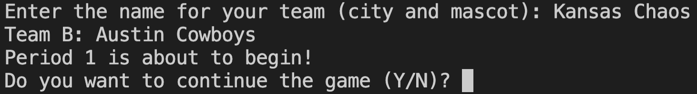
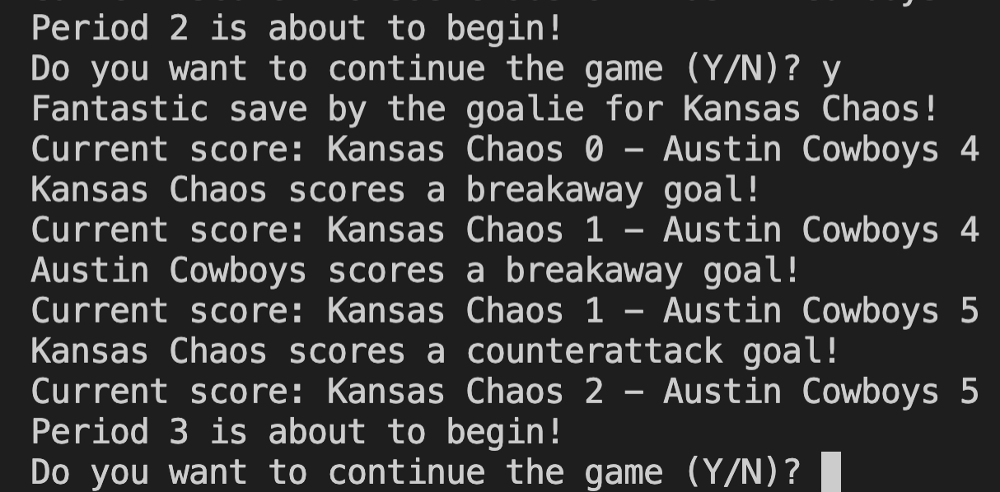

# PyHockey

## What is this?

An extremely simple python-based hockey game. This was created to practice else/if/while loops and lists. Beginner-friendly code is filled with comments to follow along.

## Screenshots

